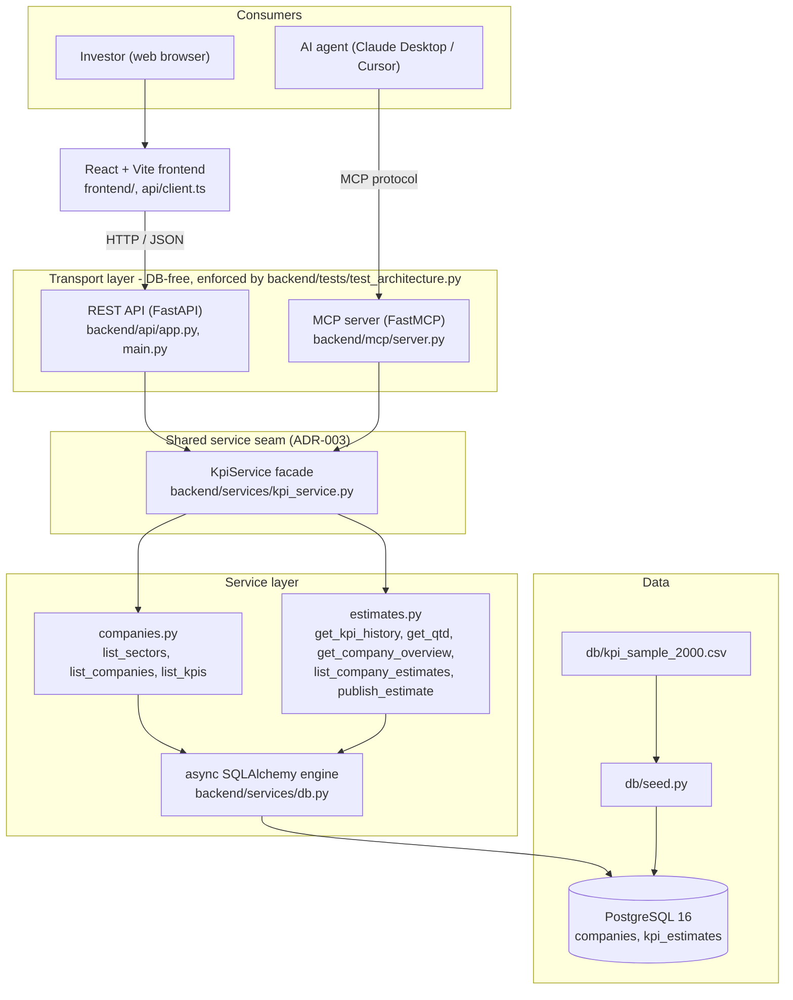
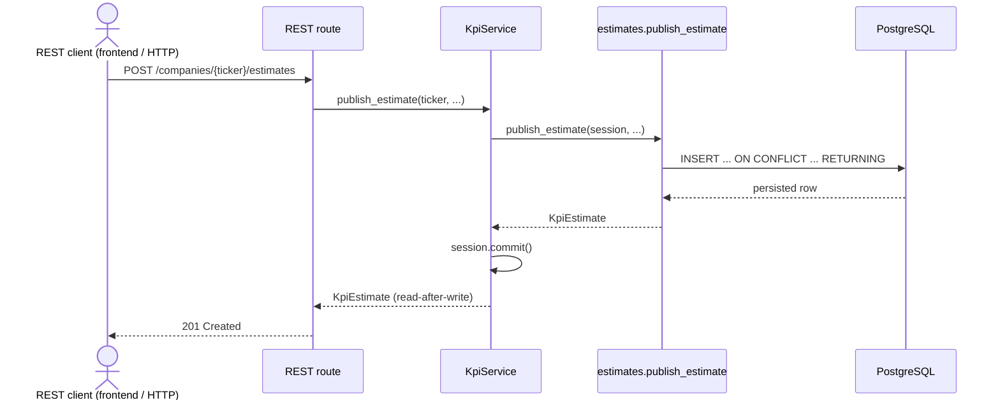

# Architecture

> Diagrams are grounded in the actual repo — every box is a real module/file. Both Mermaid
> blocks below were validated (no syntax errors). Intended to embed in the README.

## Container view — two consumers, two transports, one shared seam

The point of the whole design is the convergence in the middle: a human (via the React frontend
and REST) and an AI agent (via the MCP server) are **two transports that meet at one seam** —
the `KpiService` facade (ADR-003) — not two parallel stacks. Each transport is a thin wrapper
that owns no query logic and never touches the database; that "DB-free" rule is executable, not
aspirational — `backend/tests/test_architecture.py` parses every module under `backend/api` and
`backend/mcp` and fails the build if one imports SQLAlchemy or opens a session. Below the seam,
the facade delegates to the typed service functions in `companies.py` / `estimates.py`, which run
parameterized async SQLAlchemy against Postgres; the sample CSV is a one-time seed via `db/seed.py`.

## Write path — `POST /companies/{ticker}/estimates`

Publishing is the only write in the system, and it is **REST-only** — the MCP surface is read-only
by design (6 read tools, no write tool), so an AI agent cannot publish; only the REST client does.
This traces it to show it goes through the **same
seam** as every read: the REST route hands off to `KpiService.publish_estimate`, which owns the
session and commit, while `estimates.publish_estimate` does the upsert — `INSERT ... ON CONFLICT`
targeting the partial-unique index that matches the estimate type (historical vs qtd). The
`RETURNING` clause hands the persisted row straight back, so the response is a read-after-write of
exactly what landed in `kpi_estimates` — no second round-trip, no client-side guessing.
